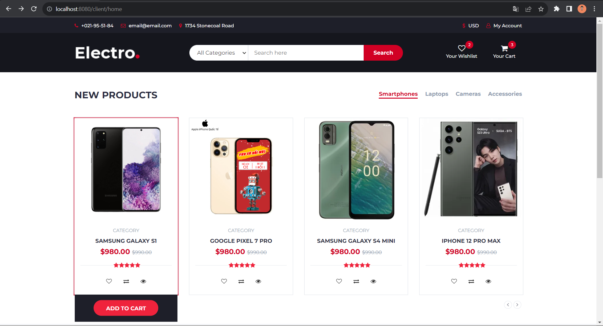

# THLTWWW_WEEK7
Bài tập tuần 7
[Localhost](http://localhost:8080)

## Yếu cầu:
Tạo một dự án sử dụng SpringBoot thực hiện:
- Hiển thị các sản phẩm, chọn vào giỏ hàng và thanh toán (giả lập việc thanh toán qua thẻ nếu có
thể)
- Một trang admin cho phép:
   + Các thao tác CRUD cho các đối tượng.
   + Thống kê order theo ngày, theo khoảng thời gian.
   + Thống kê order theo nhân viên bán hàng trong 1 khoảng thời gian.
   + *** và các chức năng khác tự nghĩ ra.
- Link template: https://themewagon.com/themes/free-bootstrap-ecommerce-template-electro/

- [Hiện sản phẩm lên trang web](https://github.com/ToHieuDong/THLTWWW_WEEK7/blob/master/src/main/java/com/example/week7/frontend/controllers/ClientController.java)
- 
- [Thêm sản phẩm với **@SessionAttributes("cart")** // Lưu giỏ hàng trong session](https://github.com/ToHieuDong/THLTWWW_WEEK7/blob/master/src/main/java/com/example/week7/frontend/controllers/CartController.java)
- 

  

